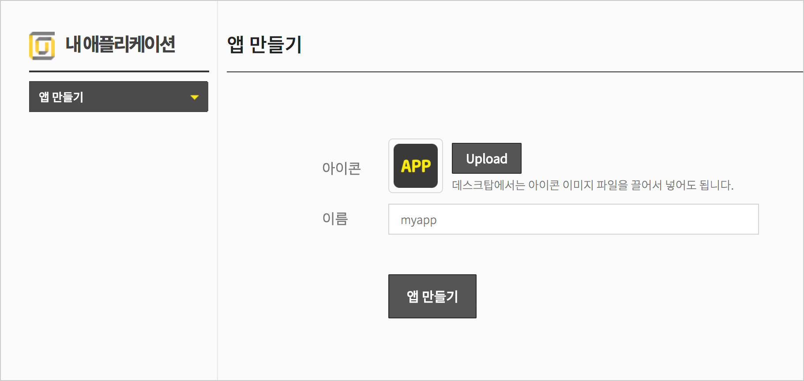
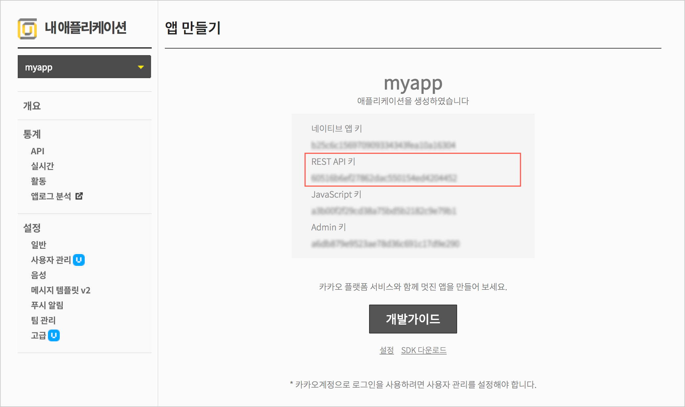
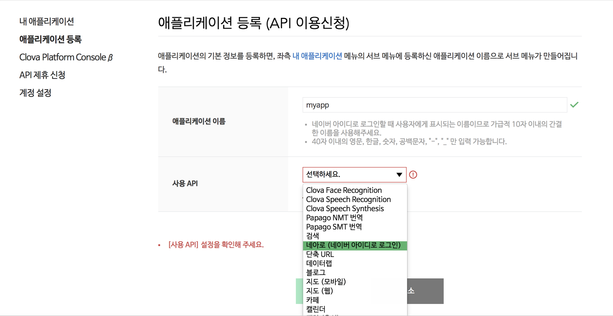
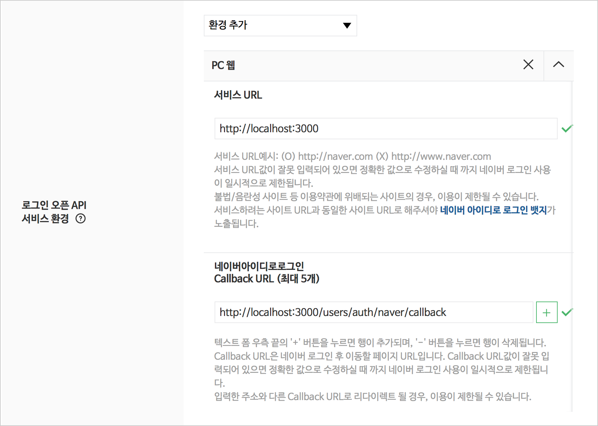
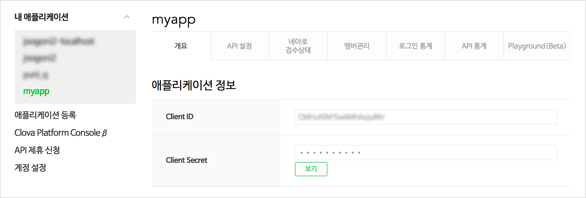

# Simple Login using Kakao & Naver OmniAuth

### 1. Gemfile Composition

Open Gemfile and add necessary gems as follows:

```ruby
gem 'bootstrap'
gem 'jquery-rails'
gem 'simple_form'
gem 'rails-env-credentials'
gem 'devise'
gem 'omniauth-kakao', github: 'luciuschoi/omniauth-kakao'
gem 'omniauth-naver'
```

Bundle install these gems as follows:

```shell
$ bundle install
```

### 2. Bootstrap Gem Install

Open application.js file and insert popper.js and bootstrap.js just below the rails-ujs as follows:

```js
//= require rails-ujs
//= require popper
//= require bootstrap
//= require activestorage
//= require turbolinks
//= require_tree .
```

Rename _application.css_ to _application.scss_ and rewrite as follows:

```scss
@import 'bootstrap';
```

Open application layout file and add `.container` style class to body tag

```erb
<body>
  <div class="container">
    <%= yield %>
  </div>
</body>
```

### 3. Jquery-rails Gem Install

Bootstrap need jquery library and so you should install jquery-rails gem. 

Open application.js and insert jquery just above rails-ujs as follows:

```js
//= require jquery
//= require rails-ujs
//= require popper
//= require bootstrap
//= require activestorage
//= require turbolinks
//= require_tree .
```

### 4. Simple_form Gem Install

If you don't want complex form helpers, you can consider this gem. More over, this gem is well integrated into Bootstrap CSS framwork with simple command line option.

```shell
$ rails g simple_form:install --bootstrap
```

You might need to customize **lib/templates/erb/scaffold/_form.html.erb** as follows:

```erb
<%# frozen_string_literal: true %>
<%%= simple_form_for(@<%= singular_table_name %>) do |f| %>
  <%%= f.error_notification %>

  <div class="form-group">
  <%- attributes.each do |attribute| -%>
    <%%= f.<%= attribute.reference? ? :association : :input %> :<%= attribute.name %> %>
  <%- end -%>
  </div>

  <div class="form-group">
    <%%= f.button :submit, nil, class: 'btn btn-primary' %>
  </div>
<%% end %>
```

> Note: Changed style class 'form-actions' to 'form-group' and added `btn btn-primary` style class to submit button.


### 5. Rails-env-credentials Gem Install

From Rails 5.2+, all secret keys are integrated into config/_crendentails.yml.enc_. But this is not for development  but for production environment. At this point, rails-env-credentials gem is designed for development environment.

```shell
$ rails g env_credentials:edit
```

If you run the above command, vi will create and open credentials-development.yml file. In default state, **secret** key only is defined. On closing the vi saving your keys, _credentials-development.yml.enc_ file will be created.

You can access secret key as _**Rails.application.credentials.secret**_.

### 6. Devise Gem Install

At first, install devise using rails generator as follows:

```shell
$ rails g devise:install
```

Next, generate User model for devise as follows:

```shell
$ rails g devise User
```

If you want to customize devise view files, execute the following command. You can find them in app/views/users directory with option `users`

```shell
$ rails g devise:views users
```

Don't forget that you should assign _**secret_key**_(12th code line) in config/initializers/devise.rb as follows:

```ruby
config.secret_key = Rails.application.credentials.secret_key_base
```

Finally, run `rails db:migrate` to create `users` table.

```shell
$ rails db:migrate
```

### 7. Omniauth-kakao Gem Install

To use Kakao Login API, in advance, you should read https://developers.kakao.com/docs/restapi/user-management.

You need kakao_client_id on using omniauth-kakako gem.
So you visit https://developers.kakao.com/apps to register your app.

##### (1) Create New App

https://developers.kakao.com/apps/new

First of all, create your app.



On completion, you can get the result as follows:



Among four keys, RESP API key, which will be assigned to kakao_client_id key, is needed.

Let's add this key to **credentails-development.yml.enc file**.

```shell
$ rails env_credentials:edit
```

Add keys as follows:

```ruby
# aws:
#  access_key_id: 123
#  secret_access_key: 345
kakao_client_id: s6215e8268213878be92ea9bf17b
# Used as the base secret for all MessageVerifiers in Rails, including the one protecting cookies.
secret_key_base: 1a11fceb379a7b6e6773f1a21e0460186e677450d55d755445115f83f6e6773bb6e677c2f28d67f7d8443f1a6e67760184653b8eb379a7b6e6771a21e08ef97051
```


### 8. Omniauth-naver Gem Install

You need kakao_client_id on using omniauth-kakako gem.
So you visit https://developers.naver.com/apps to register your app.





Client ID to naver_key and Client Secret to naver_secret

Let's add these keys to **credentails-development.yml.enc file**.

```shell
$ rails env_credentials:edit
```

Add keys as follows:

```ruby
# aws:
#  access_key_id: 123
#  secret_access_key: 345
kakao_client_id: s6215e8268213878be92ea9bf17b
naver_key: eidjd88MRDFmsjsdjf8
naver_secret: ARS_DD2SH
# Used as the base secret for all MessageVerifiers in Rails, including the one protecting cookies.
secret_key_base: 1a11fceb379a7b6e6773f1a21e0460186e677450d55d755445115f83f6e6773bb6e677c2f28d67f7d8443f1a6e67760184653b8eb379a7b6e6771a21e08ef97051
```


### 9. Define OmniauthCallbacksController Class

You should create app/controllers/omniauth_callbacks_controller.rb and write as follows:

```ruby 
# frozen_string_literal: true
class OmniauthCallbacksController < Devise::OmniauthCallbacksController
  def self.provides_callback_for(provider)
    class_eval %Q{
      def #{provider}
        @user = User.find_for_oauth(request.env["omniauth.auth"])

        if @user.persisted?
          sign_in_and_redirect @user, event: :authentication
          set_flash_message(:notice, :success, kind: "#{provider}".capitalize) if is_navigational_format?
        else
          session["devise.#{provider}_data"] = request.env["omniauth.auth"]
          redirect_to new_user_registration_url
        end
      end
    }
  end

  [:naver, :kakao].each do |provider|
    provides_callback_for provider
  end
end
```

And modify `devise_for :users` in **config/routes.rb** file as follows:

```ruby
devise_for :users, :controllers => {
  :omniauth_callbacks => "omniauth_callbacks"
}
```

### 10. Define A Class Method in User Model

In _**app/models/user.rb**_,

```ruby
class User < ApplicationRecord
  devise :database_authenticatable, :registerable,
         :recoverable, :rememberable, :trackable, :validatable
  devise :omniauthable, omniauth_providers: %i[kakao naver]

  def self.find_for_oauth(auth)
    user = where(auth.slice(:provider, :uid)).first_or_create do |user|
      user.provider = auth.provider
      user.uid = auth.uid
      user.email = auth.info.email
      user.password = Devise.friendly_token[0,20]
      user.name = auth.info.name   # assuming the user model has a name
      user.image = auth.info.image # assuming the user model has an image
    end
    user
  end
end
```

Now, let's go to url http://localhost:3000/users/sign_in and click `Log in with Kakao` link.

Voila~ 